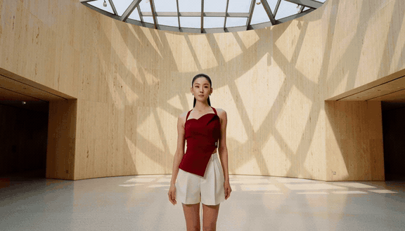

<div align="center">

# H3-Flash

**面向 MiniMax H3 的开源全栈推理加速方案。**

[English](README.md) · **简体中文**

[样例](#样例) · [模式与延迟](#推理模式) ·
[快速开始](#快速开始) · [网页演示](#网页演示) · [工作原理](#工作原理)

</div>

H3-Flash 是面向
[MiniMax H3](https://github.com/MiniMax-AI/MiniMax-H3) 的开源推理加速栈。
在完成预热的 8×B200 常驻 Worker 上，它可以在约 **1.1 秒内生成 5.167 秒
480p 视频**，或在约 **2.5 秒内生成 5.167 秒 768p 视频**，并同时生成同步音频。

H3-Flash 将多 GPU 序列并行、融合算子、
并行 VAE 解码、常驻推理服务，以及可选的 @ModelTC
[LightX2V Turbo4](https://huggingface.co/lightx2v/Minimax-h3-Turbo) 适配器组合在一起。
纯系统优化与近似加速被拆分为不同模式，速度与效果之间的边界清晰、可复现。

## 亮点

- **低延迟：** 在 8×B200 上，生成 5.167 秒的 768p 视频和立体声音频，
  常驻 Worker 端到端延迟约为 2.5 秒。
- **三种模式：** OFFICIAL 官方基线，LOSSLESS 无模型近似加速，
  FLASH 最低延迟。
- **部署简单：** 克隆仓库、安装运行环境、下载权重，即可生成视频。

## 新闻

- **2026-09-03** — H3-Flash 发布：在 8×B200 上，2.5 秒生成一段带同步音频的
  5 秒 768p 视频，并提供推理脚本与可自行部署的网页 Demo。

## 样例

点击任意预览即可播放带声音的 MP4。

<table>
  <tr>
    <td width="50%"><a href="assets/samples/flash/cinematic_glacier_escape.mp4?raw=1"></a><br><b>冰川逃生</b><br>自然的大画幅动作场面、可信的冰体运动与同步撞击声</td>
    <td width="50%"><a href="assets/samples/flash/neon_metro_runner.mp4?raw=1"></a><br><b>霓虹地铁跑酷</b><br>次世代 3D 游戏美术、干净几何结构、视差与同步动作</td>
  </tr>
  <tr>
    <td width="50%"><a href="assets/samples/flash/capybara_giant_dumpling.mp4?raw=1"></a><br><b>巨型饺子</b><br>现代角色动画、稳定形体、鲜明反应与拟音</td>
    <td width="50%"><a href="assets/samples/flash/studio_dance.mp4?raw=1"></a><br><b>单人舞蹈</b><br>中国单人舞者、干净商业人像、富有表现力的编舞与节奏音频</td>
  </tr>
</table>

样例由 FLASH 模式生成，Prompt 与随机种子记录在
[`configs/evals/h3-showcase4-10s-v1.json`](configs/evals/h3-showcase4-10s-v1.json)。

## 推理模式

- **OFFICIAL** · `1×B200` · **官方基线** — 官方 BF16 推理流程。
- **LOSSLESS** · `8×B200` · **无模型近似** — Ulysses SP8、并行/编译 VAE
  与融合算子等。
- **FLASH** · `8×B200` · **近似加速** — 在 LOSSLESS 基础上使用 @ModelTC 的
  [LightX2V Turbo4](https://huggingface.co/lightx2v/Minimax-h3-Turbo)。

**常驻 Worker 预热后的端到端延迟（秒）**

| 分辨率 | 标称时长 | OFFICIAL<br><sub>1×B200</sub> | LOSSLESS<br><sub>8×B200</sub> | FLASH<br><sub>8×B200</sub> |
|---:|---:|---:|---:|---:|
| 480p | 5s | 52.917 | 6.563 | **1.097** |
| 480p | 10s | 123.084 | 14.995 | **2.172** |
| 480p | 15s | 206.002 | 23.916 | **3.086** |
| 768p | 5s | 176.452 | 20.807 | **2.546** |
| 768p | 10s | 486.991 | 57.301 | **6.060** |
| 768p | 15s | 852.360 | 103.299 | **10.323** |

每个单元格均为四条固定 Prompt 在完成预热后的中位数。端到端计时从文本编码前开始，
到带完整音频的视频写入 MP4 后结束；不包含模型加载、首次编译、Prompt 增强、排队及
网络传输。OFFICIAL 使用官方 Diffusers/PyAV 写出，LOSSLESS 与 FLASH 使用优化后的
FFmpeg 写出。标称 5 秒、10 秒和 15 秒的测试分别使用 124、243 和 345 帧，24 FPS
下的实际视频时长为 5.167 秒、10.125 秒和 14.375 秒。同一组数值与测试口径也以
机器可读形式保存在
[`benchmarks/results/b200_e2e.json`](benchmarks/results/b200_e2e.json)。

完整的 40 条 Prompt 评测集位于
[`configs/evals/h3-broad40-v1.1.json`](configs/evals/h3-broad40-v1.1.json)。

### 同一 Prompt，三种模式效果

每一行均使用相同的 Prompt、随机种子、分辨率和视频时长。标注的耗时与上表采用
相同口径，均为预热后常驻 Worker 的端到端耗时。
点击任意预览即可播放带声音的 MP4。

<table>
  <tr>
    <th>OFFICIAL · 1×B200</th>
    <th>LOSSLESS · 8×B200</th>
    <th>FLASH · 8×B200</th>
  </tr>
  <tr>
    <td><a href="assets/comparisons/modes/people_mandarin_interview_official.mp4?raw=1"></a><br><b>普通话采访 · 端到端 178.512s</b></td>
    <td><a href="assets/comparisons/modes/people_mandarin_interview_lossless.mp4?raw=1"></a><br><b>普通话采访 · 端到端 20.840s</b></td>
    <td><a href="assets/comparisons/modes/people_mandarin_interview_flash.mp4?raw=1"></a><br><b>普通话采访 · 端到端 2.690s</b></td>
  </tr>
  <tr>
    <td><a href="assets/comparisons/modes/action_rooftop_parkour_official.mp4?raw=1"></a><br><b>屋顶跑酷 · 端到端 176.437s</b></td>
    <td><a href="assets/comparisons/modes/action_rooftop_parkour_lossless.mp4?raw=1"></a><br><b>屋顶跑酷 · 端到端 20.915s</b></td>
    <td><a href="assets/comparisons/modes/action_rooftop_parkour_flash.mp4?raw=1"></a><br><b>屋顶跑酷 · 端到端 2.593s</b></td>
  </tr>
</table>

| 模式 | 效果与效率 | 适用场景 |
|---|---|---|
| **OFFICIAL** | 官方 BF16 基线，速度最慢 | 基线参考与验证 |
| **LOSSLESS** | 保持相同的权重、采样过程、稠密注意力和 VAE；输出与 OFFICIAL 高度一致，但浮点计算顺序可能不同 | 兼顾最高保真度与更低延迟 |
| **FLASH** | 改变权重与采样轨迹；保留主体、动作和声音，但构图可能不同，画面和声音可能略有下降（加强 Prompt 工程可进一步改善效果） | 快速迭代与延迟敏感的在线服务 |

### Prompt 编写建议

H3-Flash 沿用 H3 原生的 Prompt 语义。建议先阅读 [@MiniMax-AI](https://github.com/MiniMax-AI)
官方提供的 [H3 Prompt Writing Skill](https://github.com/MiniMax-AI/MiniMax-H3/tree/main/skills/h3-prompt-writing)
以及其中适用于文本与关键帧生成的 [Base Prompt Guide](https://github.com/MiniMax-AI/MiniMax-H3/blob/main/skills/h3-prompt-writing/references/base-en.txt)。


## 快速开始

### 安装

**环境要求：** Linux x86_64、8×NVIDIA B200、CUDA 13.x 的
NVIDIA 驱动，以及约 300 GiB 磁盘空间。

```bash
git clone https://github.com/fluxmatrix/h3-flash.git
cd h3-flash

export H3_FLASH_RUNTIME_ROOT=/data/h3-flash-runtime
scripts/setup.sh
```

安装脚本会在隔离环境中安装锁定版本的依赖，下载并校验模型权重，准备 FLASH 模式，
且不会修改系统 Python。如果模型需要鉴权，请登录一次后重新运行 `scripts/setup.sh`：

```bash
$H3_FLASH_RUNTIME_ROOT/venv/bin/python -m huggingface_hub.cli.hf auth login
scripts/setup.sh
```

### 生成视频

```bash
scripts/generate.sh \
  --mode FLASH \
  --prompt "A fast FPV flight through an autumn forest reveals a vast waterfall." \
  --output-dir "$H3_FLASH_RUNTIME_ROOT/artifacts/forest-waterfall"
```

生成的视频位于
`$H3_FLASH_RUNTIME_ROOT/artifacts/forest-waterfall/output.mp4`。长 Prompt 可使用
`--prompt-file`；也可以通过 `--mode` 选择 `LOSSLESS` 或 `OFFICIAL`。
该命令会启动一次性 Worker，因此包含模型加载和预热时间；如需获得上表中的常驻
请求延迟，请使用下方网页服务。

运行时文件默认保存在代码库同级的 `.h3-flash-runtime` 目录中。

### 网页演示

```bash
scripts/serve.sh
```

打开 `http://127.0.0.1:8000`。常驻 FLASH Worker 只需加载和预热一次，
之后通过任务队列处理浏览器请求。如需部署 LOSSLESS 模式，请运行
`scripts/serve.sh LOSSLESS`。演示服务没有身份认证，默认仅监听本机地址。

<details>
<summary><b>已验证的软件栈</b></summary>

- Python 3.12.14
- PyTorch 2.13.0+cu130
- Diffusers `abc5e9bf71fd38f53cd471bc3acaa84bc5ecbfdc`

初始化脚本会自动安装这些锁定版本。

</details>

## 工作原理

<table>
  <tbody>
    <tr><th colspan="3">LOSSLESS</th></tr>
    <tr>
      <th>优化手段</th>
      <th>基本原理</th>
      <th>端到端中位数减少</th>
    </tr>
    <tr><td>稠密 Ulysses SP8</td><td>将序列拆分到八张 GPU 上计算</td><td><strong>−144.262 s（−81.3%）</strong>；1→8 GPU</td></tr>
    <tr><td>Video VAE Tile 并行</td><td>在多张 GPU 上解码官方 VAE Tile，再恢复原始顺序</td><td><strong>−4.624 s（−17.3%）</strong></td></tr>
    <tr><td>Triton 逐元素/QK 融合</td><td>融合逐元素、QK 归一化和 RoPE 操作</td><td><strong>−3.598 s（−12.7%）</strong></td></tr>
    <tr><td>Ulysses 集合通信打包</td><td>Q、K、V 打包为一次按目标 Rank 排列的集合通信</td><td><strong>−2.464 s（−10.0%）</strong></td></tr>
    <tr><td>FFmpeg 原始视频输出</td><td>将原始 RGB 帧和 PCM 音频直接传给 FFmpeg</td><td>FLASH 模式下<strong>−0.961 s（−27.5%）</strong></td></tr>
    <tr><td>静态 Video VAE 编译</td><td>PyTorch Inductor 编译固定形状的官方解码器</td><td>−0.436 s（−2.0%）；启动增加 50.289 s</td></tr>
    <tr><td>Rank 本地输入与紧凑输出</td><td>在各 Rank 上执行投影，只收集紧凑输出</td><td>−0.136 s（−0.6%）</td></tr>
    <tr><td>Pinned D2H、常量缓存与分配器复用</td><td>复用锁页内存缓冲区并缓存请求间不变的数据</td><td>对完整请求影响较小或无明显变化</td></tr>
    <tr><th colspan="3">FLASH</th></tr>
    <tr>
      <th>优化手段</th>
      <th>基本原理</th>
      <th>端到端中位数减少</th>
    </tr>
    <tr><td>LightX2V Turbo4</td><td>应用 Turbo LoRA，并使用四步采样</td><td>相比 LOSSLESS <strong>−18.215 s（−83.9%，6.22×）</strong></td></tr>
  </tbody>
</table>

## 项目结构

```text
apps/          可自行部署的网页演示
assets/        精选的小规模输出样例
benchmarks/    针对算子与数据搬运的微基准测试
configs/       评测集与优化项元数据
locks/         锁定的上游/模型版本与权重哈希
profiles/      可直接运行的 OFFICIAL、LOSSLESS、FLASH 及消融配置
scripts/       环境安装、推理与基准测试入口
src/h3_flash/  推理运行时
tests/         CPU 契约测试
tools/         维护者使用的报告与画廊生成工具
```

模型权重、虚拟环境、上游代码副本、FFmpeg 二进制文件和生成产物均保存在本代码库之外。

## 路线图 / TODO

- [x] 发布 OFFICIAL、LOSSLESS 和 FLASH 推理模式
- [x] 支持 Prompt 输入、任务队列和 MP4 播放的常驻网页服务
- [ ] 在不降低人类偏好评分的前提下，通过蒸馏及强化学习减少采样步数并提升效果
- [ ] 优化其他型号 GPU 上的推理效率

## 致谢

感谢以下项目让 H3-Flash 成为可能：

- **基础模型：** [MiniMax H3](https://github.com/MiniMax-AI/MiniMax-H3)
- **运行时：** [Hugging Face Diffusers](https://github.com/huggingface/diffusers)
  与 PyTorch
- **并行与算子：**
  [DeepSpeed Ulysses](https://github.com/microsoft/DeepSpeed)、
  [NVIDIA Sana](https://github.com/NVlabs/Sana)、
  [SGLang](https://github.com/sgl-project/sglang) 与
  [FlashAttention](https://github.com/Dao-AILab/flash-attention)
- **加速模型：** @ModelTC 的 [LightX2V](https://github.com/ModelTC/LightX2V)
- **社区参考：** [FastVideo](https://github.com/hao-ai-lab/FastVideo)、[fal](https://x.com/fal)
- **媒体处理：** FFmpeg 与 libx264

FluxMatrix 负责 H3 集成、优化组合、验证门禁与性能测量。具体版本和依赖用途记录在
[`locks/upstreams.toml`](locks/upstreams.toml) 与
[`THIRD_PARTY.md`](THIRD_PARTY.md) 中。

## 许可证

H3-Flash 源代码采用 [Apache-2.0](LICENSE) 许可证。MiniMax H3 权重受
MiniMax H3 Community License Agreement 约束；LightX2V 模型文件与其他第三方组件
保留各自的许可条款。模型权重从上游下载，不随本代码库分发。

H3-Flash 仍在积极开发中。
